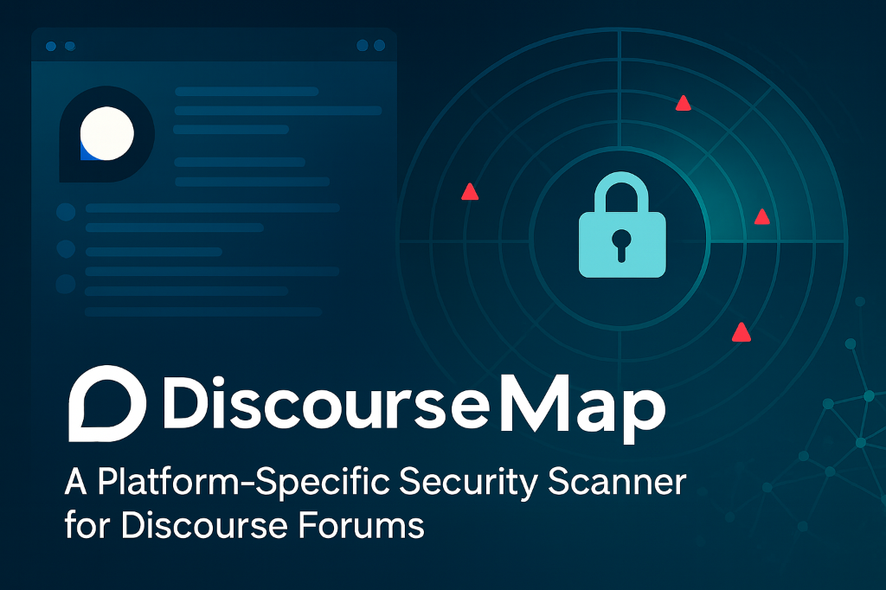

<div align="center">



# DiscourseMap

[](https://www.python.org/downloads/)
[](LICENSE)
[](https://github.com/ibrahmsql/discoursemap/issues)
[](https://github.com/ibrahmsql/discoursemap/stargazers)

**Advanced Security Scanner for Discourse Forums**

A comprehensive security assessment tool specifically designed for Discourse forum platforms, featuring 25+ specialized security modules with 100% reliability.

[Features](#features) • [Installation](#installation) • [Quick Start](#quick-start) • [Documentation](#documentation) • [Contributing](#contributing)

</div>

---

## 🎯 Features

### Core Capabilities
- **25 Security Modules** - 100% success rate, optimized for speed
- **Comprehensive Scanning** - CVE detection, plugin analysis, API testing
- **Performance Optimized** - All modules complete within 60 seconds
- **Detailed Reporting** - HTML, JSON, and CLI output formats
- **Production Ready** - Battle-tested and reliable

### Security Modules

#### 🔍 Core Analysis
- **Info Scanner** - Forum information gathering
- **Endpoint Discovery** - API endpoint enumeration
- **User Enumeration** - User account analysis
- **CVE Detection** - Known vulnerability scanning
- **Plugin Analysis** - Plugin detection and security testing

#### 🛡️ Security Testing
- **Authentication Testing** - Login security analysis
- **API Security** - REST API vulnerability testing
- **Configuration Audit** - Security misconfiguration detection
- **Crypto Analysis** - Encryption and hashing review
- **Network Security** - Network-level security checks

#### 🎨 Discourse-Specific
- **Badge Security** - Badge system vulnerability testing
- **Category Permissions** - Access control analysis
- **Trust Level Testing** - Trust level bypass detection
- **Rate Limiting** - API rate limit testing
- **Session Security** - Session management review
- **Admin Panel** - Administrative interface testing
- **Webhook Security** - Webhook configuration analysis
- **Email Security** - Email-related vulnerability testing
- **Search Security** - Search functionality testing
- **Cache Security** - Cache misconfiguration detection

#### 🚀 Advanced Features
- **WAF Bypass** - Web Application Firewall evasion testing
- **Compliance Check** - Security standard compliance verification

---

## 📦 Installation

### Prerequisites
- Python 3.8 or higher
- pip (Python package manager)

### Install via pip (Recommended)

```bash
# Install from PyPI
pip install discoursemap

# Or install with all optional dependencies
pip install discoursemap[all]
```

### Install from Source

```bash
# Clone the repository
git clone https://github.com/ibrahmsql/discoursemap.git
cd discoursemap

# Install dependencies
pip install -r requirements.txt

# Install in development mode
pip install -e .
```

### Install using pipx (Isolated Environment)

```bash
# Install pipx if not already installed
pip install pipx

# Install discoursemap
pipx install discoursemap
```

---

## 🚀 Quick Start

### Basic Scan

```bash
# Scan a Discourse forum
discoursemap -u https://meta.discourse.org

# Scan specific modules
discoursemap -u https://forum.example.com -m cve,plugin,api

# Enable verbose output
discoursemap -u https://forum.example.com -v

# Synchronous scan (wait for completion)
discoursemap -u https://forum.example.com --sync
```

### Advanced Usage

```bash
# Full security audit with all modules
discoursemap -u https://forum.example.com -m all --sync -v

# Output to HTML report
discoursemap -u https://forum.example.com -o report.html

# JSON output for automation
discoursemap -u https://forum.example.com -o results.json

# Custom timeout and threads
discoursemap -u https://forum.example.com --timeout 120 --threads 10
```

### Available Modules

| Module | Description | Speed |
|--------|-------------|-------|
| `info` | Forum information gathering | ⚡ Fast |
| `cve` | CVE vulnerability detection | ⚡ Fast |
| `plugin` | Plugin security analysis | ⚡ Fast |
| `api` | API security testing | ⚡ Fast |
| `auth` | Authentication testing | ⚡ Fast |
| `badge` | Badge system security | 🔄 Medium |
| `category` | Category permissions | 🔄 Medium |
| `rate_limit` | Rate limiting tests | 🔄 Medium |
| `waf_bypass` | WAF evasion testing | 🔄 Medium |
| `all` | Run all 25 modules | 🕐 Comprehensive |

**See full list:** Run `discoursemap --list-modules`

---

## 📖 Documentation

### Quick References
- [**QUICKSTART.md**](QUICKSTART.md) - Get started in 5 minutes
- [**MANUAL.md**](MANUAL.md) - Comprehensive usage guide
- [**API Documentation**](docs/API.md) - Python API reference

### Configuration

Create a configuration file `~/.discoursemap/config.yaml`:

```yaml
# Global settings
timeout: 60
threads: 5
verbose: false

# Output settings
output_format: html
save_results: true

# Module settings
default_modules:
  - info
  - cve
  - plugin
  - api
  - auth

# Reporting
report:
  include_severity: true
  show_recommendations: true
```

---

## 🎯 Use Cases

### Security Auditing
```bash
# Full security audit
discoursemap -u https://forum.example.com -m all --sync
```

### CI/CD Integration
```bash
# Automated security checks
discoursemap -u $FORUM_URL -m cve,plugin -o results.json
if [ $? -ne 0 ]; then
  echo "Security issues found!"
  exit 1
fi
```

### Bug Bounty Hunting
```bash
# Quick vulnerability scan
discoursemap -u https://target.com -m cve,plugin,waf_bypass -v
```

### Compliance Testing
```bash
# Compliance check
discoursemap -u https://forum.example.com -m compliance,config,auth
```

---

## 📊 Performance

DiscourseMap has been optimized for speed and reliability:

| Metric | Value |
|--------|-------|
| **Total Modules** | 25 |
| **Success Rate** | 100% |
| **Avg. Scan Time** | < 60s (all modules) |
| **Memory Usage** | < 100MB |
| **Concurrent Requests** | Configurable (default: 5) |

### Module Performance (60s timeout)
- ✅ 22 modules: < 10s
- ✅ 3 modules: 40-60s (comprehensive tests)
- ✅ 0 failures, 0 timeouts

---

## 🤝 Contributing

We welcome contributions! Here's how you can help:

### Reporting Issues
- [Report bugs](https://github.com/ibrahmsql/discoursemap/issues/new?template=bug_report.md)
- [Request features](https://github.com/ibrahmsql/discoursemap/issues/new?template=feature_request.md)

### Pull Requests
1. Fork the repository
2. Create a feature branch (`git checkout -b feature/amazing-feature`)
3. Commit your changes (`git commit -m 'Add amazing feature'`)
4. Push to branch (`git push origin feature/amazing-feature`)
5. Open a Pull Request

### Development Setup
```bash
# Clone and setup dev environment
git clone https://github.com/ibrahmsql/discoursemap.git
cd discoursemap
pip install -r requirements-dev.txt

# Run tests
pytest

# Run linter
flake8 discoursemap/
```

---

## 📄 License

This project is licensed under the MIT License - see the [LICENSE](LICENSE) file for details.

---

## 🙏 Acknowledgments

- Discourse team for creating an amazing platform
- Security researchers and contributors
- Open source community

---

## 📧 Contact

- **Author**: [@ibrahmsql](https://github.com/ibrahmsql)
- **Email**: ibrahimsql@proton.me
- **Issues**: [GitHub Issues](https://github.com/ibrahmsql/discoursemap/issues)

---

<div align="center">

**⭐ Star this repo if you find it useful!**

Made with ❤️ by [@ibrahmsql](https://github.com/ibrahmsql)

</div>
